<div align="center">

# BuddyUp — Neon Nocturne

**A location-based social networking app for Gen Z.**  
Discover friends nearby, join activities, chat, earn points, and climb the leaderboard — all wrapped in a dark neon aesthetic.


</div>

<div align="center">

| | | | |
|---|---|---|---|
| 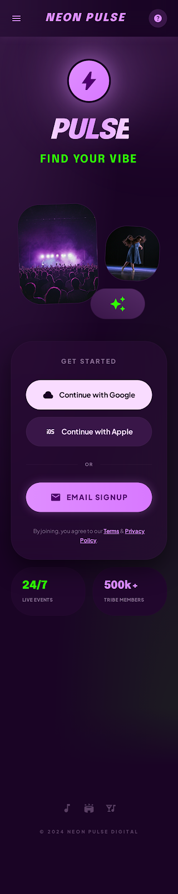<br/>Onboarding | 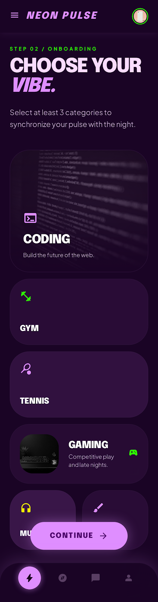<br/>Select Interests | 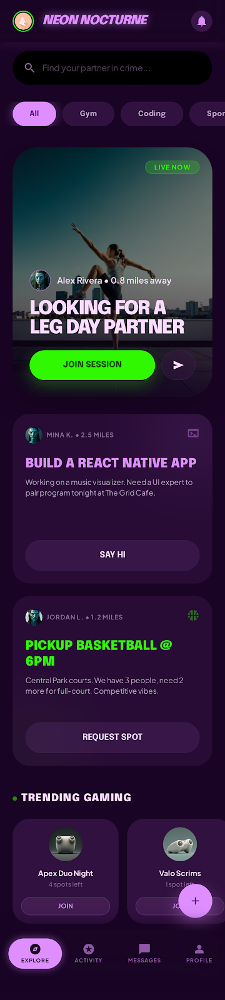<br/>Discovery Feed | 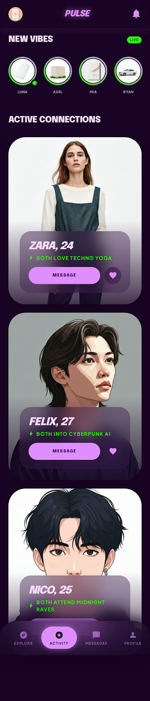<br/>Matches |
| 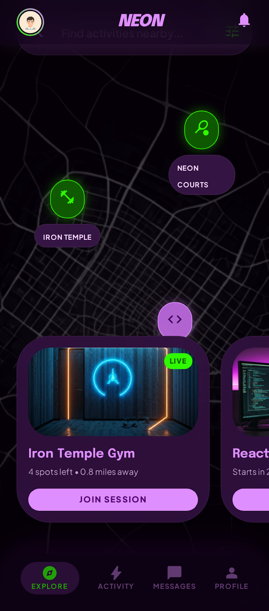<br/>Map View | 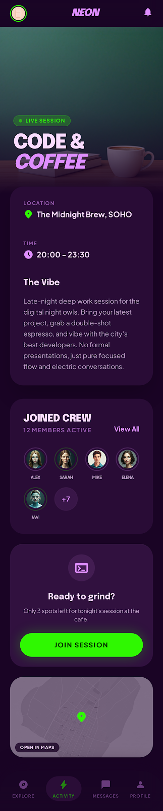<br/>Activity Details | 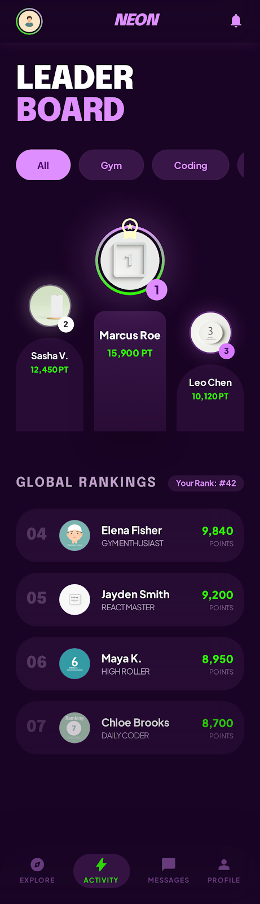<br/>Leaderboard | 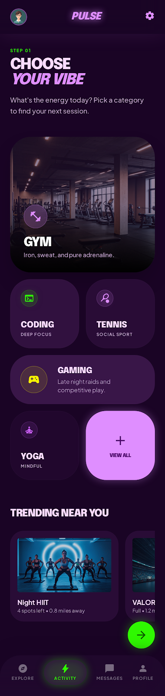<br/>Create Activity 1 |
| 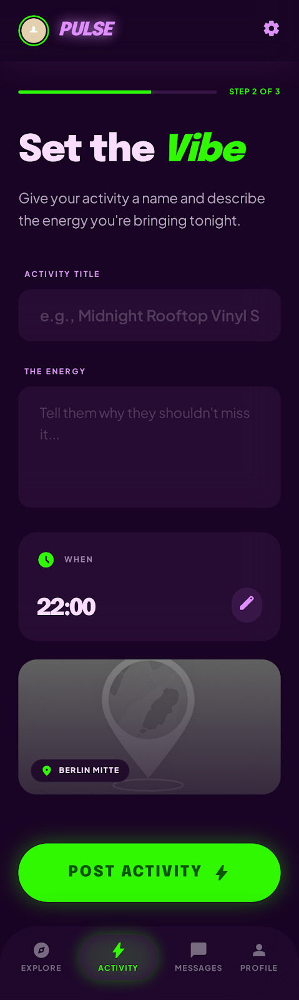<br/>Create Activity 2 | 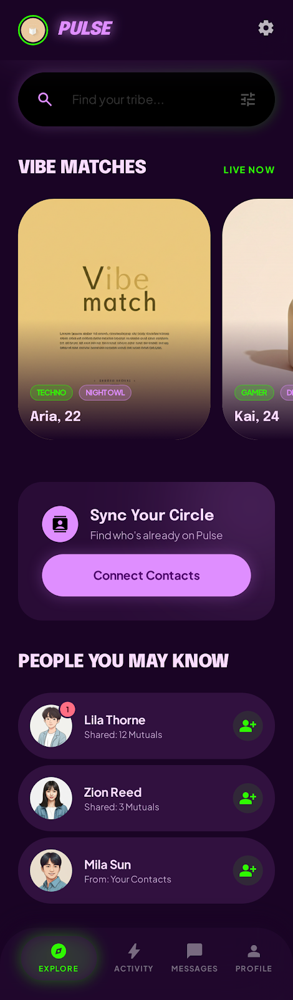<br/>Friends | 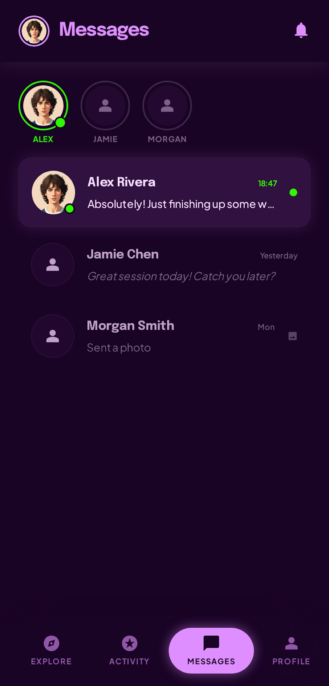<br/>Messages | 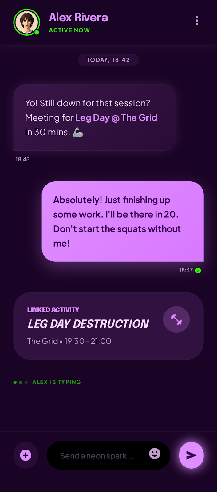<br/>Chat |
| 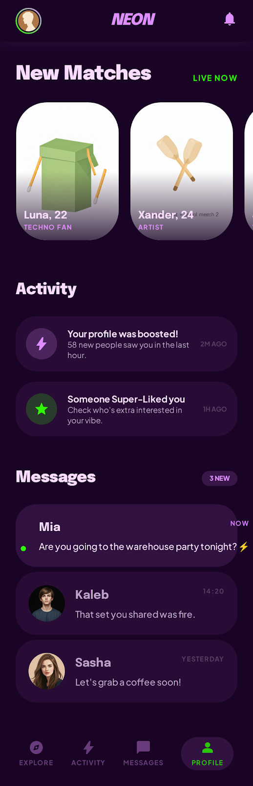<br/>Notifications | 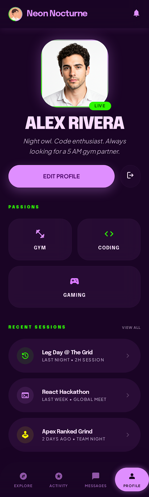<br/>Profile | 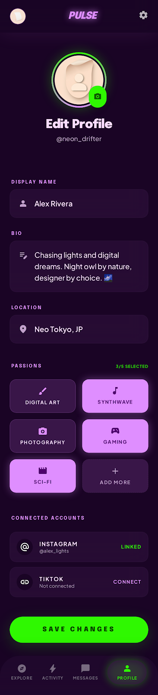<br/>Edit Profile | 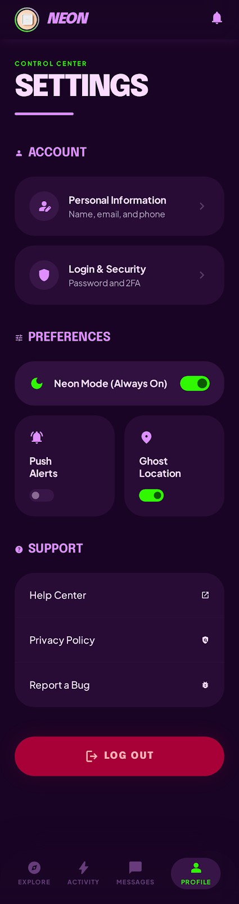<br/>Settings |

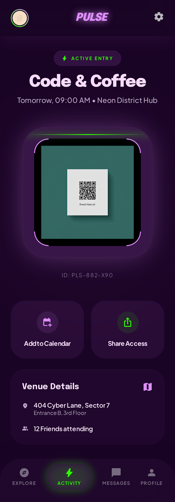<br/>Event QR Access

</div>

---

## Table of Contents

- [Overview](#overview)
- [Tech Stack](#tech-stack)
- [Project Structure](#project-structure)
- [Screens](#screens)
  - [Onboarding / Login](#1-onboarding--login)
  - [Select Interests](#2-select-interests)
  - [Discovery Feed](#3-discovery-feed)
  - [Matches & Connections](#4-matches--connections)
  - [Map View](#5-map-view)
  - [Activity Details](#6-activity-details)
  - [Leaderboard](#7-leaderboard)
  - [Create Activity — Step 1](#8-create-activity--step-1)
  - [Create Activity — Step 2](#9-create-activity--step-2)
  - [Friends Discovery](#10-friends-discovery)
  - [Messages List](#11-messages-list)
  - [Messages Chat](#12-messages-chat)
  - [Notifications Center](#13-notifications-center)
  - [User Profile](#14-user-profile)
  - [Edit Profile](#15-edit-profile)
  - [Settings](#16-settings)
  - [Event Access QR](#17-event-access-qr)
- [Design System](#design-system)
- [Backend API](#backend-api)
- [Running Locally](#running-locally)
- [Building for iOS & Android](#building-for-ios--android)

---

## Overview

BuddyUp (codename **Stitch**) is a cross-platform mobile app that helps people discover friends and group activities in their immediate vicinity. Users sign up, pick their interests, and are dropped into a live discovery feed of nearby activities — from gym sessions to midnight cycling rides. They earn points for joining and hosting activities, competing on a global leaderboard.

Core features:

- 📡 **Live Discovery Feed** — nearby activities filtered by category (Gym, Coding, Sports, Gaming…)
- 🗺️ **Interactive Map** — Mapbox-powered dark map with live activity pins
- 🤝 **Friend Matching** — swipeable friend suggestions based on shared interests
- 💬 **Real-time Chat** — 1-on-1 messaging with read receipts
- 🏆 **Leaderboard** — global points ranking with podium view
- 🎟️ **Event Tickets & QR** — digital tickets with QR access codes
- 🔔 **Notifications** — categorised match, activity, and message alerts

---

## Tech Stack

| Layer | Technology |
|---|---|
| Mobile framework | React Native 0.83 + Expo SDK 55 |
| Language | TypeScript |
| Navigation | React Navigation (Stack) |
| Maps | Mapbox (`@rnmapbox/maps`) |
| Secure storage | `expo-secure-store` |
| Location | `expo-location` |
| Backend | Go 1.26 + Gin |
| Database | SQLite via GORM |
| Auth | JWT (30-day tokens) |
| Build | EAS Build (cloud) |

---

## Project Structure

```
Hub/
├── buddyup-stitch-app/        # React Native + Expo app
│   ├── App.tsx                # Navigation root + SafeAreaProvider
│   ├── app.json               # Expo static config
│   ├── app.config.js          # Dynamic config (env-var injection)
│   ├── eas.json               # EAS Build profiles
│   ├── src/
│   │   ├── api/
│   │   │   ├── api.ts         # All API functions
│   │   │   ├── client.ts      # Base URL + fetch wrapper
│   │   │   └── types.ts       # TypeScript interfaces
│   │   ├── components/
│   │   │   └── BottomNavBar.tsx
│   │   ├── screens/           # 17 screen components (see below)
│   │   └── theme/
│   │       └── theme.ts       # Design tokens
│   └── assets/                # Icons, splash screen
│
├── buddyup-stitch-backend/    # Go REST API
│   ├── cmd/api/main.go        # Entry point (port 8080)
│   ├── internal/
│   │   ├── db/database.go     # Schema, migrations, seed data
│   │   ├── models/models.go   # GORM models
│   │   ├── handlers/          # Route handlers
│   │   ├── middleware/        # JWT auth middleware
│   │   └── router/router.go   # Route definitions
│   └── buddyup.db             # SQLite file (auto-created, gitignored)
│
└── stitch_select_interests/   # HTML design reference screens
```

---

## Screens

> Design previews are available as HTML files in `buddyup-stitch-app/designs/` and `stitch_select_interests/`. Open any `code.html` in a browser to see the full pixel-accurate design reference.

---

### 1. Onboarding / Login


**File:** `src/screens/OnboardingScreen.tsx`  
**Design:** `designs/Onboarding___Login.html`

The app's entry point. A single screen handles three modes: **start** (hero/landing), **login**, and **register** — switching between them with smooth state transitions. Features the "NEON PULSE" brand mark, an editorial image grid, and social-style sign-in buttons.

**Features:**
- Email + password login
- Name + email + password registration
- Toggle between login and register modes inline
- Loading state on submit button
- Navigates to `SelectInterests` on new account, `DiscoveryFeed` on returning login

**API:** `POST /auth/login` · `POST /auth/register`

---

### 2. Select Interests


**File:** `src/screens/SelectInterestsScreen.tsx`  
**Design:** `designs/Select_Interests.html`

Step 2 of onboarding. New users pick at least 3 interests from a masonry grid of image-backed cards. The Continue button stays disabled until the minimum is reached.

**Features:**
- Interests fetched live from the backend
- 2-column masonry grid with category icons and background imagery
- Selected cards show a neon checkmark overlay
- Progress step indicator ("STEP 02 / ONBOARDING")

**API:** `GET /interests` · `PUT /users/me/interests`

---

### 3. Discovery Feed


**File:** `src/screens/DiscoveryFeedScreen.tsx`  
**Design:** `designs/Discovery_Feed.html`

The main home screen. Activities are displayed as a large hero card + 2-up side grid, filterable by category. A horizontal friends strip and a Trending Gaming section complete the layout.

**Features:**
- Featured hero activity card with "Live Now" badge
- Side-by-side secondary activity cards
- Category filter pills (All / Gym / Coding / Sports / Gaming)
- Horizontal online friends strip (tap to chat)
- Trending Gaming section driven by live backend data
- FAB to create a new activity

**API:** `GET /activities?category=…` · `GET /friends` · `GET /users/me`

---

### 4. Matches & Connections


**File:** `src/screens/MatchesListScreen.tsx`  
**Design:** `designs/Matches_List.html`

Social hub showing friend suggestions ("New Vibes") and accepted friends ("Active Connections"). Suggestions are rendered as a live horizontal avatar strip with gradient rings and online dots. Friends appear as full-bleed portrait cards with glassmorphism info panels.

**Features:**
- "NEW VIBES" carousel with LIVE badge — top 5 suggestions
- "ACTIVE CONNECTIONS" portrait card list with shared-interest compatibility text
- MESSAGE button on each connection card (navigates to chat)
- FIND FRIENDS button (navigates to Friends Discovery)

**API:** `GET /friends/suggestions` · `GET /friends` · `GET /users/me`

---

### 5. Map View


**File:** `src/screens/MapViewScreen.tsx`  
**Design:** `designs/Map_View.html`

Full-screen Mapbox dark map (`mapbox://styles/mapbox/dark-v11`) showing the user's real-time GPS position and nearby activity pins. Tapping a pin opens a bottom preview card. Falls back to a static placeholder in environments where native Mapbox modules aren't available.

**Features:**
- Live GPS with pulsing neon green user dot
- Category-specific icon pins for each activity
- Bottom sheet preview card on pin tap (title, category, attendee count, JOIN button)
- "Center on me" floating action button
- Category chip filter row
- Location permission handling

**API:** `GET /activities` · `GET /users/me` · Device GPS via `expo-location`

---

### 6. Activity Details


**File:** `src/screens/ActivityDetailsScreen.tsx`  
**Design:** `designs/Activity_Details.html`

Full detail view for a single activity. Shows the hero image, all metadata, attendee avatar stack, and a prominent JOIN button that calls the API and toggles to a checked "JOINED" state.

**Features:**
- Full-bleed hero `ImageBackground` with gradient fade
- Animated "LIVE SESSION" badge
- Attendee avatar stack with overflow count ("+N")
- JOIN SESSION → JOINED ✓ toggle (persists join via API)
- "VIEW ON MAP" secondary action
- Activity description ("THE VIBE")

**API:** `GET /activities/:id` · `GET /users/me` · `POST /activities/:id/join`

---

### 7. Leaderboard


**File:** `src/screens/ActivityLeaderboardScreen.tsx`  
**Design:** `designs/Activity_Leaderboard.html`

Points-based global ranking with a podium view for the top 3 and a scrollable ranked list below. The current user's own row is highlighted at the bottom of the list.

**Features:**
- Top-3 podium: gradient avatar rings, crown on #1, points displayed
- Full ranked list (position 4 onward) with rank numbers, avatars, names, points
- "YOUR RANK" sticky highlighted row
- Category filter pills (visual only)
- Shivansh sits at rank 14 in the seed data (1000 pts, 20 pts from next rank)

**API:** `GET /leaderboard` · `GET /users/me`

---

### 8. Create Activity — Step 1


**File:** `src/screens/CreateActivityStep1Screen.tsx`  
**Design:** `designs/Create_Activity_-_Step_1.html`

First step of the two-step activity creation flow. The user selects an activity category ("vibe") from a grid of image and icon cards. A "Trending" preview strip shows popular live sessions.

**Features:**
- 2-column category grid (Gym / Coding / Tennis / Gaming / Yoga)
- Selected card shows neon border + green checkmark badge
- "TRENDING" live sessions horizontal strip with slot availability labels
- CONTINUE button disabled until a category is chosen

**API:** None — passes selected category to Step 2 via navigation params.

---

### 9. Create Activity — Step 2


**File:** `src/screens/CreateActivityStep2Screen.tsx`  
**Design:** `designs/Create_Activity_-_Step_2.html`

Second step: fill in the activity details. 3-segment linear progress bar, title + description fields, time picker, location map preview, and a POST IT submit button.

**Features:**
- Progress bar (step 2 of 3 highlighted)
- Activity title text input
- Multiline "The Energy" description field
- Time row with edit icon
- Map thumbnail for location input + location text field
- "POST IT" gradient button with loading state

**API:** `POST /activities`

---

### 10. Friends Discovery


**File:** `src/screens/FriendsDiscoveryScreen.tsx`  
**Design:** `designs/Friends_Discovery.html`

Finding and adding new friends. A swipeable "Vibe Matches" section shows user cards with shared interests and a CONNECT button. Below it, incoming friend requests can be accepted or declined.

**Features:**
- "VIBE MATCHES / LIVE NOW" horizontal card carousel
- Online status dot + interest tags on each suggestion card
- CONNECT button → toggles to checkmark once request is sent
- "FRIEND REQUESTS" section with accept (green) / decline (red) buttons
- Search bar with filter icon

**API:** `GET /friends/suggestions` · `GET /friends/requests` · `POST /friends/request` · `PUT /friends/requests/:id` · `GET /users/me`

---

### 11. Messages List


**File:** `src/screens/MessagesListScreen.tsx`  
**Design:** `designs/Messages___Chat.html`

The messaging inbox showing all conversations sorted by most-recent message. A horizontal quick-contacts strip at the top shows the 5 most recent conversation partners with online indicators.

**Features:**
- Quick-contacts horizontal strip (top 5, online rings)
- Conversation list with avatar, name, last-message preview, relative timestamp
- Smart time formatting (today = HH:MM, yesterday = "Yesterday", older = weekday)
- Unread indicator per conversation

**API:** `GET /conversations` · `GET /users/me`

---

### 12. Messages Chat


**File:** `src/screens/MessagesChatScreen.tsx`  
**Design:** `designs/Messages___Chat.html`

1-on-1 chat screen. Own messages appear as right-aligned gradient bubbles; received messages are left-aligned glassmorphism bubbles. Read receipts show per-message. `KeyboardAvoidingView` keeps the input above the keyboard on iOS.

**Features:**
- Right-aligned gradient send bubbles with read-receipt icon
- Left-aligned glass receive bubbles
- Timestamps per message
- "TODAY" divider
- Input bar with add-media, emoji, and send buttons
- "ACTIVE NOW" status in header

**API:** `GET /messages` (client-side filtered) · `POST /messages` · `GET /users/me`

---

### 13. Notifications Center


**File:** `src/screens/NotificationsCenterScreen.tsx`  
**Design:** `designs/Notifications_Center.html`

Categorised notification inbox split into NEW MATCHES, ACTIVITY, and MESSAGES sections. Unread notifications show a highlighted card style with a coloured left-edge accent. A "MARK ALL AS READ" button optimistically updates the UI.

**Features:**
- Unread count badge in title
- "MARK ALL AS READ" button
- Per-section grouping: Matches / Activity / Messages
- Highlighted card style for unread items + left accent bar
- Navigation to relevant screen on tap (MatchesList, DiscoveryFeed, MessagesChat)

**API:** `GET /notifications` · `PUT /notifications/read` · `GET /users/me`

---

### 14. User Profile


**File:** `src/screens/UserProfileScreen.tsx`  
**Design:** `designs/User_Profile.html`

The current user's profile page. Shows photo, name, bio, points, global rank, and interest tags. A "SET YOUR VIBE" status row opens a bottom-sheet picker with 5 mood options.

**Features:**
- Large gradient-ringed profile photo with "LIVE" badge
- Vibe status picker (Open to Connect / Squad Goals / On a Mission / Solo Mode / Chilling)
- Stats row: Total Points · Global Rank · Friends
- Interest chip tags
- "EDIT PROFILE" button
- Settings navigation

**API:** `GET /users/me` · `GET /leaderboard` (for rank computation)

---

### 15. Edit Profile


**File:** `src/screens/EditProfileScreen.tsx`  
**Design:** `designs/Edit_Profile.html`

Form screen for updating display name, bio, and interests. Loads current data on mount. Changes are saved in parallel (profile + interests) via the "Save" button in the header.

**Features:**
- Profile photo with gradient ring + camera-badge overlay
- Display name text input (prefilled)
- Bio multiline text input (prefilled)
- "MY PASSIONS" horizontally-scrollable interest chip row (toggle on/off)
- Save button in header (shows "…" while saving)

**API:** `GET /users/me` · `GET /interests` · `PUT /users/me` · `PUT /users/me/interests`

---

### 16. Settings


**File:** `src/screens/SettingsScreen.tsx`  
**Design:** `designs/Settings_Screen.html`

Control-centre style settings page with grouped sections. Toggle switches for Neon Mode, Push Alerts, and Ghost Location are shown with colour-coded icon backgrounds. Only "Personal Information" (→ EditProfile) is wired; other rows are UI placeholders.

**Features:**
- ACCOUNT section: Personal Information (→ EditProfile), Login & Security
- PREFERENCES section: Neon Mode toggle (default on), Push Alerts toggle, Ghost Location toggle
- DANGER ZONE: Logout / Delete Account
- Custom toggle component (colour-shifting track)

**API:** None (all local state).

---

### 17. Event Access QR


**File:** `src/screens/EventAccessQRScreen.tsx`  
**Design:** `stitch_select_interests/event_access_qr/code.html`

Digital event ticket screen. Shows the user's first upcoming ticket with a glowing QR code placeholder, event metadata, venue details, and action buttons for calendar and sharing.

**Features:**
- "ACTIVE ENTRY" badge with bolt icon
- Event name + formatted date/time
- Glow-bordered QR code card (placeholder icon, `PLS-882-X90` fallback ID)
- "Add to Calendar" + "Share Access" action buttons
- Venue details section (location + attendee count)

**API:** `GET /tickets/me` · `GET /users/me`

---

## Design System

The app uses a **Neon Nocturne** design language:

| Token | Value | Usage |
|---|---|---|
| Background | `#1a0425` | Screen backgrounds |
| Primary | `#df8eff` | Accents, icons, borders |
| Secondary (Neon Green) | `#2ff801` | CTAs, online dots, live badges |
| Text Primary | `#f9dcff` | Headings, body text |
| Error | `#ff6e84` | Decline buttons, errors |
| Surface L1 | `#290c36` | Cards |
| Surface L2 | `#31113f` | Elevated cards |
| Surface L3 | `#391648` | Modals |
| Surface L4 | `#3e1b4e` | Header overlays |

**Rules:**
- No 1px borders — use colour-shift backgrounds instead
- Glassmorphism: `rgba(255,255,255,0.08)` + `blur(20px)` for floating surfaces
- Gradients: 135° from `#df8eff` → `#c96ef0`
- Typography: **Epilogue** (display/headings) · **Plus Jakarta Sans** (body/labels)

---

## Backend API

Base URL: `http://localhost:8080` (dev) — override with `EXPO_PUBLIC_API_BASE_URL`.

### Auth (public)
| Method | Path | Description |
|---|---|---|
| `POST` | `/auth/register` | Register new user |
| `POST` | `/auth/login` | Login, returns JWT |
| `GET` | `/auth/me` | Get current user (JWT) |

### Protected (`/api/v1/*` — requires `Authorization: Bearer <token>`)
| Method | Path | Description |
|---|---|---|
| `GET` | `/users/me` | Current user profile |
| `PUT` | `/users/me` | Update name/bio |
| `PUT` | `/users/me/interests` | Update interests |
| `GET` | `/interests` | All interests |
| `GET` | `/activities` | List activities (filter by `?category=`) |
| `GET` | `/activities/:id` | Single activity |
| `POST` | `/activities` | Create activity |
| `POST` | `/activities/:id/join` | Join activity |
| `GET` | `/leaderboard` | All users by points |
| `GET` | `/friends` | Accepted friends |
| `GET` | `/friends/suggestions` | Friend suggestions |
| `GET` | `/friends/requests` | Incoming requests |
| `POST` | `/friends/request` | Send request |
| `PUT` | `/friends/requests/:id` | Accept/decline request |
| `GET` | `/conversations` | All conversations |
| `GET` | `/messages` | All messages |
| `POST` | `/messages` | Send message |
| `GET` | `/notifications` | All notifications |
| `PUT` | `/notifications/read` | Mark all read |
| `GET` | `/tickets/me` | Current user's tickets |

---

## Running Locally

### Prerequisites
- Node.js 18+ and npm
- Go 1.21+
- Expo CLI (`npm install -g expo`)

### 1. Backend

```bash
cd buddyup-stitch-backend
export JWT_SECRET=your-secret-here   # Required — server won't start without it
go run ./cmd/api/main.go             # Starts on :8080, creates buddyup.db
```

The database auto-seeds with 20 users, 14 activities, friendships, messages, and notifications on first run. To re-seed, delete `buddyup.db` before restarting.

> **Dev user:** Shivansh (id=5) — `shivansh@example.com` / `password123`

### 2. Frontend

```bash
cd buddyup-stitch-app
npm install

# Create env file
cp .env.example .env
# Edit .env and set EXPO_PUBLIC_API_BASE_URL and EXPO_PUBLIC_MAPBOX_TOKEN

npm start    # Start Expo bundler
```

> The app uses native modules (`@rnmapbox/maps`, `expo-secure-store`) and **cannot** run in Expo Go. You need a development build or a real device.

---

## Building for iOS & Android

Builds are done via **EAS Build** (Expo's cloud build service).

### Setup (once)
```bash
npm install -g eas-cli
cd buddyup-stitch-app
eas login
eas init   # Links to your Expo account and fills in projectId
```

### Mapbox secret token (required for native iOS build)
```bash
# Add your Mapbox secret token (sk.eyJ1...) as an EAS secret:
eas secret:create --scope project --name RNMAPBOX_MAPS_DOWNLOAD_TOKEN --value "sk.eyJ1..."
```

Or set it in your shell for local builds:
```bash
export RNMAPBOX_MAPS_DOWNLOAD_TOKEN=sk.eyJ1...
```

### Build commands

| Goal | Command |
|---|---|
| Android APK (share with anyone) | `eas build --platform android --profile preview` |
| iOS ad-hoc (paid Apple account) | `eas build --platform ios --profile preview` |
| iOS via USB (free Apple account) | `npx expo run:ios --device` |
| Both platforms | `eas build --platform all --profile preview` |
| Production AAB / IPA | `eas build --platform all --profile production` |

Build profiles are defined in [eas.json](buddyup-stitch-app/eas.json):

- **`development`** — dev client with local API URL, for debugging
- **`preview`** — installable APK / ad-hoc IPA for sharing, points to your server IP
- **`production`** — App Store / Play Store submission build

> For the APK to reach your backend, set `EXPO_PUBLIC_API_BASE_URL` in `eas.json` to your machine's LAN IP (e.g. `http://192.168.1.x:8080/api/v1`). All devices must be on the same WiFi, or deploy the backend publicly.

---

<div align="center">
Built with 💜 by <a href="https://github.com/theprogrammerinyou">theprogrammerinyou</a>
</div>
